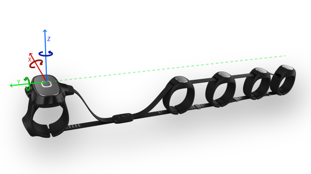
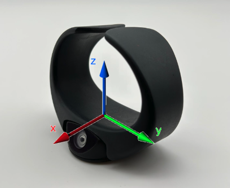

## Tap Rust SDK (alpha)

### What Is This ?
TAP rust SDK allows you to build rust app that can establish BLE connection with Tap Strap and TapXR, send commands and receive events and data - Thus allowing TAP to act as a controller for your app!  
The library is **currently in alpha**.

### Installation  
Use cargo:
```console
cargo add tap-sdk
```

Or clone this repo:
```console
git clone https://github.com/VladChekunov/tap-rust-sdk
cd tap-rust-sdk
cargo build
```


Then just import the main class
```rust
let mut tap_client = tap_sdk::Client::new(None).await.unwrap();
tap_client.run().await;
```

Note that the SDK will not scan for BLE peripherals, therefore you'll have to pair the Tap device manually with your machine.

Also make sure that you have updated your Tap device to the latest version.

### Features
This SDK implements two basic interfaces with a Tap device.

First is setting the operation mode:
1. *Text mode* - the Tap device will operate normally, with no events being sent to the SDK
2. *Controller mode* - the Tap device will send events to the SDK
3. *Controller and Text mode* - the Tap device will operate normally, in parallel with sending events to the SDK
4. *Raw data mode* - tha Tap device will stream raw sensors data to the SDK.

Second, subscribing to the following events:
1. *Tap event* - whenever a tap event has occured
2. *Mouse event* - whenever a mouse movement has occured
3. *AirGesture event* - whenever one of the gestures is detected
4. *Raw data* - whenever new raw data sample is being made.

Additional to these functional event, there are also some state events, such as connection and disconnection of Tap devices to the SDK backend.

#### Spatial Control
Authorized developers can gain access to the experimantal Spatial Control features:
1. Extended AirGesture state - enabling aggregation for pinch, drag and swipe gestures.
2. Select input type - enabling the selection of input type to be activated - i.e. AirMouse/Tapping. 

These featureas are only available on TapXR and only for qualified developers. Request access [here](https://www.tapwithus.com/contact-us/)

### High level API
The SDK uses callbacks to implement user functions on the various events. To register a callback, you just have to instance a TapSDK object and just:

```rust
fn on_tapped(identifier: Uuid, tapcode: u8) {
    println!("{} tapped {}", identifier.to_short_string(), tapcode);
}

tap_client.register_tap_events(on_tapped).await;
```

### Raw sensors mode
**Make sure that "Developer mode" is enabled on TapManager app for this mode to work properly**
In raw sensors mode, the Tap device continuously sends raw data from the following sensors:
1. Five 3-axis accelerometers - one per each finger (**available only on TAP Strap and Tap Strap 2**).
    * sampled at 200Hz
    * allows dynamic range configuration (±2G, ±4G, ±8G, ±16G)
2. IMU (3-axis accelerometer + gyro) located on the thumb (**available on TAP Strap 2 and TapXR**).
    * sampled at 208Hz. 
    * allows dynamic range configuration for the accelerometer (±2G, ±4G, ±8G, ±16G) and for the gyro (±125dps, ±250dps, ±500dps, ±1000dps, ±2000dps).

The sensors measurements are given with respect to the reference system below.





Each sample (of accelerometer or imu) is preambled with a millisecond timestamp, referenced to an internal Tap clock.

The dynamic range of the sensors is determined with the `set_input_mode` method by passing a `sensitivity` integers list of length 3 with the following elements (by order): 
1. Fingers accelerometers sensitivity - 

    | value | sensitivity | scale factor (mg/LSB)|
    | :---: | :---: | :---: | 
    | 0 (default) | ±16G | 31.25 |
    | 1 | ±2G | 3.91 |
    | 2 | ±4G | 7.81 |
    | 3 | ±8G | 15.62 |
    | 4 | ±16G | 31.25 |


2. IMU gyro sensitivity - 
    | value | sensitivity | scale factor (mdps/LSB)|
    | :---: | :---: | :---: |
    | 0 (default) | ±500dps | 17.5 |
    | 1 | ±125dps | 4.375 |
    | 2 | ±250dps | 8.75 |
    | 3 | ±500dps | 17.5 |
    | 4 | ±1000dps | 35 |
    | 5 | ±2000dps | 70 |

3. IMU accelerometer sensitivity -

    | value | sensitivity | scale factor (mg/LSB)|
    | :---: | :---: | :---: | 
    | 0 (default) | ±4G | 0.122 |
    | 1 | ±2G | 0.061 |
    | 2 | ±4G | 0.122 |
    | 3 | ±8G | 0.244 |
    | 4 | ±16G | 0.488 |

### Examples
You can run examples by running:
```console
just run-examples
```

### Support
Please refer to the issues tab!
